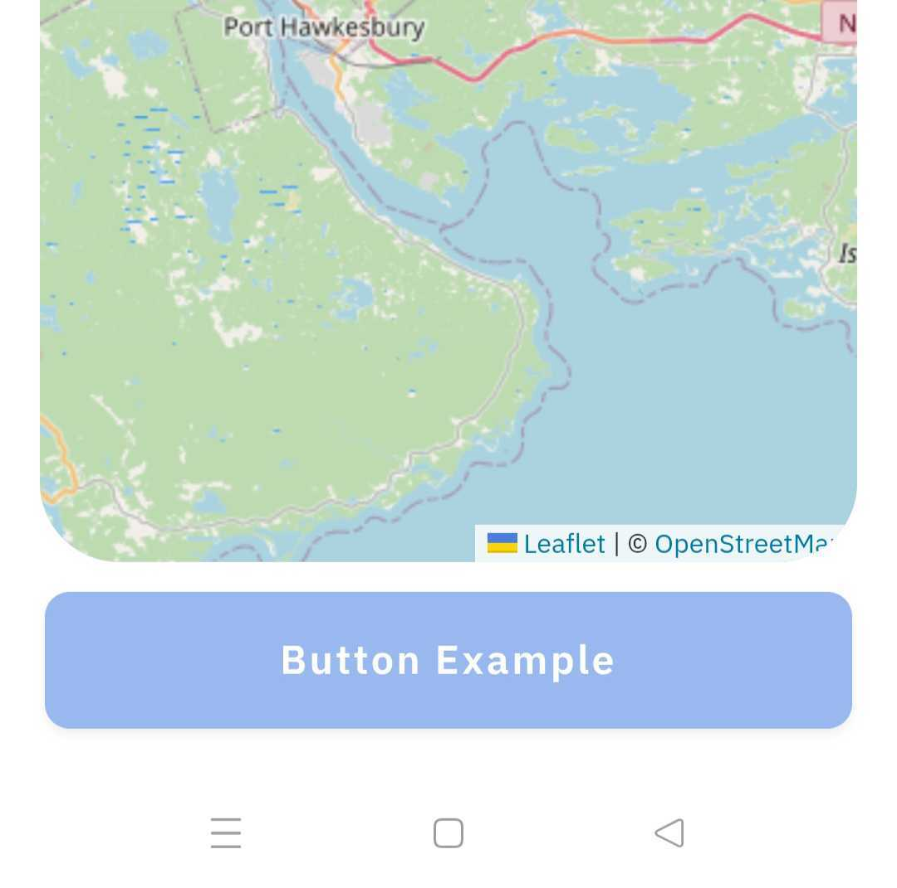
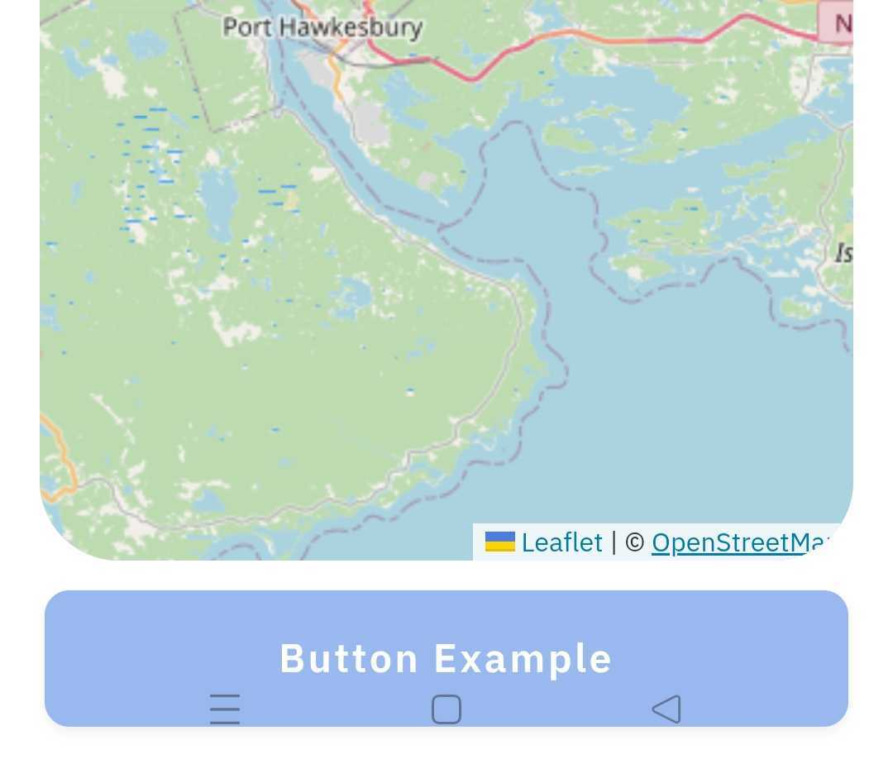

# Ionic Safe Area Patch

Patches the variables `--ion-safe-area-top`, `--ion-safe-area-bottom`. In Android 16 [EdgeToEdge is no longer optional](https://medium.com/@qamar_safadi/edge-to-edge-is-no-longer-optional-android-16-migration-guide-66f82db639c0) and therefore the variables are 0

Another explanation is in some older versions of Android WebView (< 140) has bug that prevents the access to the safe area values via the safe-area-inset-* CSS env.[Further information](https://issues.chromium.org/issues/40699457). 

Currently it can be circumvented by calculating the sizes right when the application starts and overwriting the variables.

*Warning*: This plugin will continue to work as long as the Ionic Framework does not remove the variables or there is something preventing the sizes from being calculated.


## Install

```bash
npm install github:parollon/safe-area-patch
npx cap sync
```

## Usage
This plugin only works on Android, example how to use

```typescript
import { Component } from '@angular/core';
import { SafeAreaPatch } from  'safe-area-patch'

@Component({
  selector: 'app-root',
  templateUrl: 'app.component.html',
  styleUrls: ['app.component.scss'],
  standalone: false,
})
export class AppComponent {
  constructor() {
    SafeAreaPatch.patchInsets(); //patch the insets
  }
}
```

Adding it to `global.css` applies it to all components and can cause it to apply in places where it shouldn't; it's better to apply it in specific CSS files.
`my-component.component.scss`/`my-page.page.scss`

```css
ion-content::part(scroll) {
  padding-bottom: var(--ion-safe-area-bottom, 0px) !important;
}
```
<table>
  <thead>
    <tr>
      <th>Safe area patch</th>
      <th>With css Snippet</th>
      <th>Without css snippet</th>
    </tr>
  </thead>
  <tbody>
      <tr>
          <td>
              Screenshot:   
          </td>
          <td>
              
          </td>
          <td>
  
          </td>
      </tr>
  </tbody>
</table>

## Note

The plugin only runs when you call pathInsets(), any changes are not detected , and if you want to restore to original insets then you need to repatch


```typescript
import { Component } from '@angular/core';
import { SafeAreaPatch } from  'safe-area-patch'

@Component({
  selector: 'app-root',
  templateUrl: 'app.component.html',
  styleUrls: ['app.component.scss'],
  standalone: false,
})
export class AppComponent {
  constructor() {
    SafeAreaPatch.patchInsets(); //patch the insets

    this.changeInsetsSizes() 
    .then(
       //some logic that changes insets
       //After these changes i want to restore original insets
    ).then( ()=>SafeAreaPatch.patchInsets())//Re-patched insets
  }
  async changeInsetsSizes(){
    //Some logic
  }
}

```
## API

<docgen-index>

* [`patchInsets()`](#patchinsets)

</docgen-index>

<docgen-api>
<!--Update the source file JSDoc comments and rerun docgen to update the docs below-->

### patchInsets()

```typescript
patchInsets() => Promise<void>
```

--------------------

</docgen-api>
